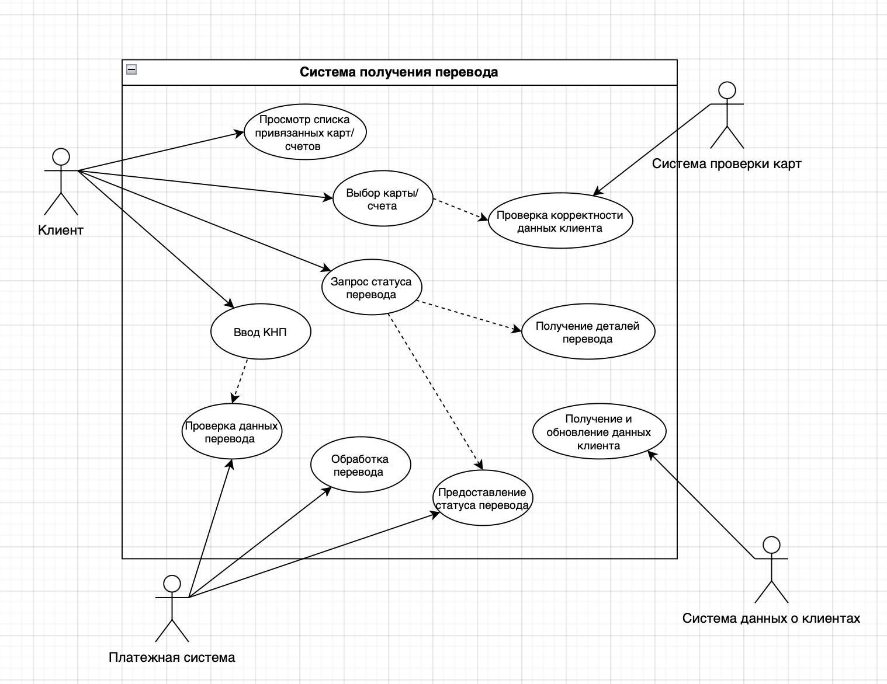
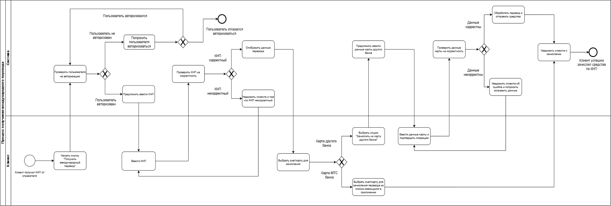
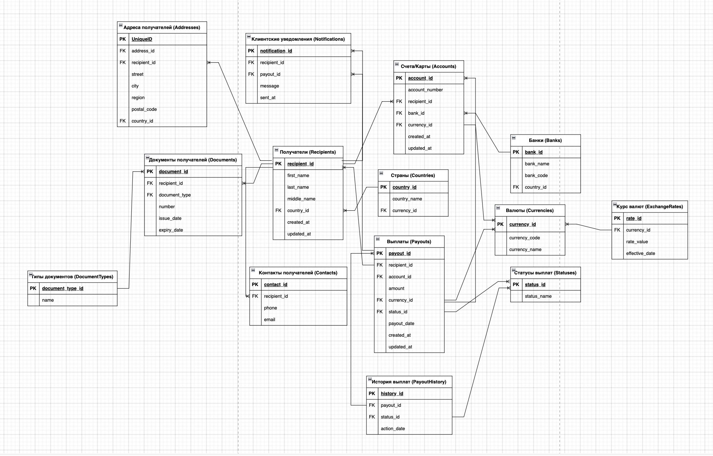
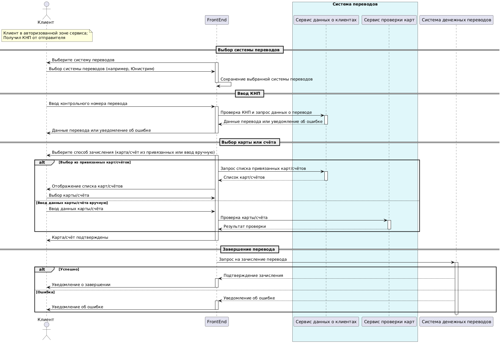

# Выплата переводов на карты и счета физлиц

Мой итоговый проект в Финтех Академии МТС, направление «Системный аналитик» (ноябрь 2024 - январь 2025).

Задача: клиент банка получает перевод по контрольному номеру (КНП) прямо в мобильном приложении и зачисляет деньги на свою карту или счет, в том числе в другом банке.

## Что сделал

- собрал требования: пользовательские истории, сценарии использования, функциональные и нефункциональные требования
- описал процесс в BPMN
- нарисовал макеты экранов в Figma
- спроектировал модель данных
- нарисовал диаграмму последовательности
- описал REST API: методы, запросы и ответы

Все это собрано в одну спецификацию.

## Файлы

- [main project.pdf](main%20project.pdf) - спецификация требований, главный документ
- [presentation.pdf](presentation.pdf) - презентация с защиты
- [figma-demo.mp4](figma-demo.mp4) - запись прототипа, [сам прототип в Figma](https://www.figma.com/proto/iOEzDCFGyen9QdcYz72OeN/Untitled?node-id=0-1&t=TLVq4V4GCppbtDwl-1)
- [diagrams](diagrams) - диаграммы картинками, ER-диаграмма еще и исходником для draw.io
- [certificate.pdf](certificate.pdf) - сертификат об окончании

## Диаграммы

Варианты использования

Процесс выплаты в BPMN

Модель данных

Диаграмма последовательности

